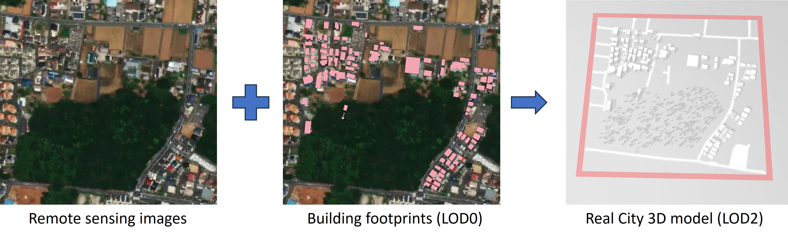

# gen3D_realCity
Input building footprint and generate .obj and CityGML(.gml) files for real city 3D scene


Function impression
----------------


Command example:
```
python gen3d.py --input gen3d_realCity_testData/mapbox/test02/footprint/footprint_test_2_selected.geojson --img gen3d_realCity_testData/mapbox/test02/satellite_image/test02_0_3.tiff --building_lod 2 --road_width 2 2
```

# TODO

- Improve the vegetation and road extraction performance. (Change from YOLO/P2CNet to InternImage)
- Improve building generation speed and performance.
- Revise the topological relationship of relief/road/cityFurniture/vegetation