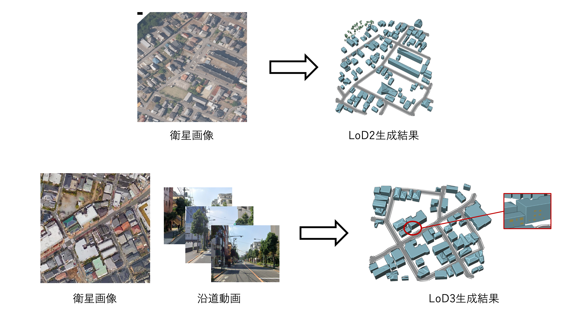

# 3D都市モデル生成シミュレータ

## 1. 概要

本リポジトリでは、令和6年度のProject PLATEAUで開発した「3D都市モデル生成ツール」のソースコードを公開しています。

「3D都市モデル生成ツール」は、建物フットプリントデータやユーザーが指定するパラメータに基づき、3D都市モデル（建築物、道路、植生、都市設備）を自動で生成するWebオーサリングツールです。このツールは、衛星画像や沿道画像の範囲の3D都市モデルの作成に対応しており、詳細レベル（LOD）の向上機能（LOD1-3）を備えています。

※本プロジェクトは、令和6年度「都市デジタルツインの実現に向けた研究開発及び実証調査業務」（内閣府/研究開発とSociety5.0との橋渡しプログラム（BRIDGE））の一部として実施されました。

## 2. 「3D都市モデル生成ツール」について

「3D都市モデル生成シミュレータ」プロジェクトは、3D都市モデルのアクセシビリティとスケーラビリティを高め、都市デジタルツインの作成コストを大幅に削減することを目指しています。この目標達成のために、最新の自動生成AI技術を核とする3D都市モデル生成シミュレータが開発されました。

このシミュレータは、建築物、道路、都市設備、植生を含む主要なモデルを網羅し、LOD（詳細レベル）、形状、高さ、種別などのパラメータをユーザーが自由に設定できる設計になっています。また、生成された3D都市モデルをCityGML形式で出力し、ツール上での視覚化も可能です。

## 3. 利用手順

本システムの構築手順及び利用手順については利用チュートリアルを参照してください。

## 4. システム概要

### 【3D都市モデル生成】

1. **衛星画像リファレンス機能**  
   - 衛星画像に基に、建物輪郭・屋根形状・道路・植生を抽出するとともに、それらの空間分布に基づき、AIを用いて3D都市モデルを生成します。
   - インスタンスセグメンテーションやセマンティックセグメンテーション等を用いたアルゴリズムを採用しています。

2. **沿道映像リファレンス機能 (LOD3のみ)**  
   - 沿道映像からLOD3に必要な開口部情報に関するパラメータを抽出します。  
   - 三次元再構築、セグメンテーション、点群ラベリングを用いたアルゴリズムを採用しています。

3. **パラメータ設定機能**  
   - LOD、スケール、対象地物、乱数シードなどの汎用的なパラメータを設定可能です。  
   - 各地物特有のパラメータ設定も可能です。

4. **実際の都市における仮想3D建築物モデル生成機能**  
   - パラメータ(LOD, 建物輪郭、屋根形状，高さ)に基づいて、3D建築物を生成し、CityGML(PLATEAU v4)形式で出力します。  
   - PLATEAUの3D建築物モデルを学習して、衛星画像と沿道画像（LOD３の場合）から3D建築物モデルを生成します。

5. **道路モデル生成機能**  
   - ユーザが設定したパラメータ (LOD, 道路種別, 幅員) に基づいて、道路モデルを生成し配置します。  
   - CityGML (PLATEAU v4) 形式で出力されます。

6. **植生モデル生成機能**  
   - ユーザが設定したパラメータ (LOD, 種別) に基づいて、植生モデルを生成し配置します。  
   - CityGML (PLATEAU v4) 形式で出力されます。

7. **都市設備モデル生成機能**  
   - ユーザが設定した入力パラメータ (LOD, 種別) に基づいて、都市設備モデルを生成し配置します。  
   - CityGML (PLATEAU v4) 形式で出力されます。

8. **可視化機能**  
   - 生成した3D都市モデルはツール上で可視化されます。

## 5. 利用技術
| 種別         | 名称                                                                                                        | バージョン  | 内容                                                                                                              |
| ------------ | ----------------------------------------------------------------------------------------------------------- | ----------- | ----------------------------------------------------------------------------------------------------------------- |
| ソフトウェア | [PyCharm Community](https://www.jetbrains.com/pycharm/)                                                     | -           | Pythonで開発する際に使用するソフトウェア                                                                            |
|              | [Visual Studio Code](https://code.visualstudio.com/)                                                        | -           | C++で開発する際に使用するソフトウェア                                                                               |
|              | [Feature Manipulation Engine (FME)](https://www.safe.com/fme/)                                                | -           | 建物GMLファイルをOBJに変換する際に使用するソフトウェア                                                                |
| ライブラリ   | [Computational Geometry Algorithms Library (CGAL)](https://www.cgal.org/)                                   | -           | メッシュを生成、最適化する際に使用するライブラリ                                                                      |
|              | [OpenCV](https://opencv.org/)                                                                                 | 4.7.0.72    | 二次元画像データに関する処理に効果的なライブラリ                                                                     |
|              | [Point Cloud Library (PCL)](http://pointclouds.org/)                                                        | -           | 三次元点群データに関する処理に効果的なライブラリ                                                                     |
|              | [CCCoreLib](https://github.com/lopezbec/CCCoreLib)                                                   | -           | 建物OBJファイルを点群にサンプリングする際に使用するライブラリ                                                          |
|              | [PyTorch](https://pytorch.org/)                                                                               | 2.5.0       | 生成的モデルの実行に必要となり、基本的な深層学習モジュールも提供されるライブラリ                                        |
|              | [torchvision](https://pytorch.org/vision/stable/)                                                             | 0.20.0      | 画像の読み込み、前処理、モデル訓練、評価などのタスクを簡素化するライブラリ                                             |
|              | [cudatoolkit](https://developer.nvidia.com/cuda-toolkit)                                                      | -           | GPU高速計算をサポートし、CUDAプログラミングや複数GPUでの並列処理を実現するライブラリ                                   |
|              | [conda-forge](https://conda-forge.org/)                                                                       | -           | Conda環境におけるバージョン管理、環境隔離、クロスプラットフォーム互換性などを実現するライブラリ                           |
|              | [yacs](https://github.com/rbgirshick/yacs)                                                                     | -           | 設定ファイルを定義・管理するためのライブラリ                                                                         |
|              | [pyyaml](https://pyyaml.org/)                                                                                 | -           | YAML形式のデータを読み込み、修正し、書き込むために使用されるライブラリ                                                 |
|              | [scipy](https://www.scipy.org/)                                                                               | 1.9.1       | numpyに基づく科学計算ライブラリ。線形代数、積分・微分方程式、信号処理などの数学アルゴリズムを提供                      |
|              | [numpy](https://numpy.org/)                                                                                   | -           | 大量の次元配列と行列演算をサポートするライブラリ                                                                       |
|              | [openmim](https://github.com/open-mmlab/OpenMIM)                                                              | -           | OpenMMLabコミュニティ開発のコマンドラインツール。機械学習モデルやアルゴリズムライブラリの管理を簡素化する                  |
|              | [mmcv-full](https://github.com/open-mmlab/mmcv)                                                               | 2.2.0       | コンピュータビジョン研究と深層学習プロジェクトの基本機能とツールを提供し、CUDA操作をサポートするライブラリ                 |
|              | [mmsegmentation](https://github.com/open-mmlab/mmsegmentation)                                                 | -           | 深層学習による画像分割モデルの訓練と推論フレームワークを提供するオープンソースのセグメンテーションライブラリ             |
|              | [mmdet](https://github.com/open-mmlab/mmdetection)                                                             | -           | 目標検出ライブラリ。深層学習による画像分割モデルの訓練と推論フレームワークの提供に特化している                           |
|              | [timm](https://github.com/rwightman/pytorch-image-models)                                                    | 0.6.11      | PyTorchに基づく深層学習画像モデルライブラリ。多数の現代の画像認識・分類モデルの実装が含まれている                         |
|              | [gdal](https://gdal.org/)                                                                                     | 3.4.1       | 多様な空間データ形式を読み書きするために使用されるライブラリ                                                           |
|              | [ogr](https://gdal.org/) *(GDALのサブセット)*                                                                 | -           | GDALのサブセット。ベクターデータの処理に特化している                                                                |
|              | [pandas](https://pandas.pydata.org/)                                                                          | 1.5.3       | 高性能で使いやすいデータ構造とデータ分析ツール。DataFrameやSeriesをサポートし、CSV、Excel、JSON、HTMLなどの処理が可能    |
|              | [geopandas](https://geopandas.org/)                                                                           | 0.10.2      | pandasを拡張し、地理空間データの処理に特化したライブラリ                                                              |
|              | [shapely](https://shapely.readthedocs.io/)                                                                    | -           | 平面オブジェクトの作成、空間分析、トポロジー分析機能を含むライブラリ                                                   |
|              | [argparse](https://docs.python.org/3/library/argparse.html)                                                   | -           | Python標準ライブラリ。プログラム実行時のオプションとパラメータを指定可能にする                                        |
|              | [albumentations](https://github.com/albumentations-team/albumentations)                                        | -           | 画像の前処理とデータ拡張のために設計されたライブラリ                                                                   |
|              | [pytorch-lightning](https://www.pytorchlightning.ai/)                                                         | -           | PyTorchの複雑さを簡素化することを目指す高度な深層学習フレームワーク                                                   |
|              | [omegaconf](https://omegaconf.readthedocs.io/)                                                                  | -           | 軽量な設定ライブラリ。YAMLやJSONなどの設定ファイルのマージ、補間、型チェック機能を提供                                |
|              | [test-tube](https://github.com/wandb/test-tube)                                                                | -           | 機械学習実験の結果追跡・整理・分析、ハイパーパラメータの最適化と実験のバージョン管理をサポート                          |
|              | [einops](https://github.com/arogozhnikov/einops)                                                                | -           | テンソル操作とリシェイプを直感的に行うためのライブラリ。多次元データの再配置、次元変換、スケーリングを処理                  |
|              | [transformers](https://huggingface.co/transformers)                                                           | 4.38.2      | 自然言語処理（NLP）ライブラリ。BERT、GPT、RoBERTaなどの事前訓練済みモデルの実装を提供                                 |
|              | [kornia](https://github.com/kornia/kornia)                                                                     | -           | PyTorchに基づくコンピュータビジョンライブラリ。微分可能な視覚変換関数を提供し、GPU加速と自動微分をサポート                  |
|              | [open_clip_torch](https://github.com/mlfoundations/open_clip)                                                 | -           | OpenAI CLIPに似た機能を提供するPyTorchベースのライブラリ。自然言語プロンプトを用いた画像検索・理解を実現                  |
|              | [torchmetrics](https://torchmetrics.readthedocs.io/)                                                          | -           | モデル評価用の標準指標（正確性、精度、再現率など）を提供し、性能評価を統一するライブラリ                                |
|              | [addict](https://github.com/mewwts/addict)                                                                     | -           | Pythonのdictを拡張し、属性アクセスで動的にネストされたdictを扱いやすくするライブラリ                                   |
|              | [yapf](https://github.com/google/yapf)                                                                         | -           | Pythonコードフォーマットツール。PEP 8スタイルに準拠し、コードの可読性と一貫性を向上させる                              |
|              | [trimesh](https://github.com/mikedh/trimesh)                                                                   | 4.5.3       | 三次元メッシュの読み込み、処理、表示、分析を行うライブラリ。多様なファイル形式に対応                                |
|              | [random](https://docs.python.org/3/library/random.html)                                                       | -           | 擬似乱数生成ライブラリ。整数、浮動小数点数、シーケンスから要素選択、ランダムな文字生成を提供                       |
|              | [lxml](https://lxml.de/)                                                                                       | 5.1.0       | XML及びHTMLドキュメントの解析用ライブラリ。迅速なアクセス、修正、作成が可能                                          |
|              | [earcut](https://github.com/mapbox/earcut)                                                                     | 1.1.5       | 軽量な多角形三角形分割ツール。複雑な多角形を三角形メッシュに変換する際に使用                                          |
|              | [math](https://docs.python.org/3/library/math.html)                                                            | -           | Python標準ライブラリ。一連の数学関数と定数を提供（例：三角関数、対数関数、指数関数など）                               |
|              | [detectron2](https://github.com/facebookresearch/detectron2)                                                   | -           | 画像認識や物体検出モデルの構築に使用するライブラリ                                                                   |
|              | [onnx](https://onnx.ai/)                                                                                       | -           | 深層学習モデルの相互運用性を実現するためのオープンフォーマット                                                       |
|              | [onnxruntime](https://www.onnxruntime.ai/)                                                                     | 1.14.1      | ONNX形式の深層学習モデルの高速推論に使用するランタイム                                                              |
|              | [xgboost](https://xgboost.readthedocs.io/)                                                                     | 1.6.2       | 勾配ブースティングを用いた機械学習モデルの構築に使用するライブラリ                                                    |
|              | [classifier_free_guidance_pytorch](https://github.com/cloneofsimo/classifier-free-guidance-pytorch)             | 0.6.10      | 生成モデルのガイダンスにおいてクラス分類を使用しない手法を実装するためのPyTorchライブラリ                              |
|              | [open3d](http://www.open3d.org/)                                                                               | 0.19.0      | 3次元データの処理や可視化に使用するライブラリ                                                                        |
|              | [sentencepiece](https://github.com/google/sentencepiece)                                                     | 0.2.0       | 自然言語処理におけるサブワード単位のトークン化を実現するライブラリ                                                     |
|              | [optimum](https://github.com/huggingface/optimum)                                                              | 1.23.2      | Transformerモデル等の機械学習モデルの推論最適化に使用するライブラリ                                                   |
|              | [triangle](https://www.cs.cmu.edu/~quake/triangle.html)                                                       | -           | 2次元メッシュ生成および最適な三角分割を実現するために使用するライブラリ                                               |

## 6. 動作環境

| 項目   | 最小動作環境     | 推奨動作環境      |
| ------ | ---------------- | ----------------- |
| OS     | Ubuntu 20.08     | 同左              |
| GPU    | メモリ16GB以上   | NVIDIA A100推奨   |
| Python | Anaconda       | 同左              |
| CUDA   | CUDA>=11.3     | CUDA==12.4       |

## 7. 本リポジトリのフォルダ構成

| フォルダ名                          | 詳細                                                         |
| ----------------------------------- | ------------------------------------------------------------ |
| bg_extract                         | 衛星画像から植生・道路自動抽出機能                            |
| Building_Generation_Opening        | 街路画像から建物開口部と窓口位置情報推定及びメッシュ単位LOD3建物モデル生成機能 |
| data_src                           | Plateauテンプレートデータ                                    |
| Para_calc                          | 建物高さを推定する機能                                        |
| Roof_classification_inference      | 建物フォトプリント自動抽出及び屋根タイプ自動判別機能            |
| res_example                        | 結果図例                                                     |
| util                               | データ中間処理で使うツール                                    |

## 8. ライセンス

- ソースコード及び関連ドキュメントの著作権は国土交通省に帰属します。
-    - 本ドキュメントはProject [PLATEAUのサイトポリシー](https://www.mlit.go.jp/plateau/site-policy/)（CCBY4.0及び公共データ利用規約第1.0版）に従い提供されています。

## 9. 注意事項

- 本リポジトリは参考資料として提供しているものです。動作保証は行っていません。
- 本リポジトリについては予告なく変更又は削除をする可能性があります。
- 本リポジトリの利用により生じた損失及び損害等について、国土交通省はいかなる責任も負わないものとします。

## 10. 参考資料
関連する論文
- [MeshXL](https://arxiv.org/abs/2405.20853)
- [MeshGPT](https://arxiv.org/abs/2311.15475)
- [MeshAnything](https://arxiv.org/abs/2406.10163)
