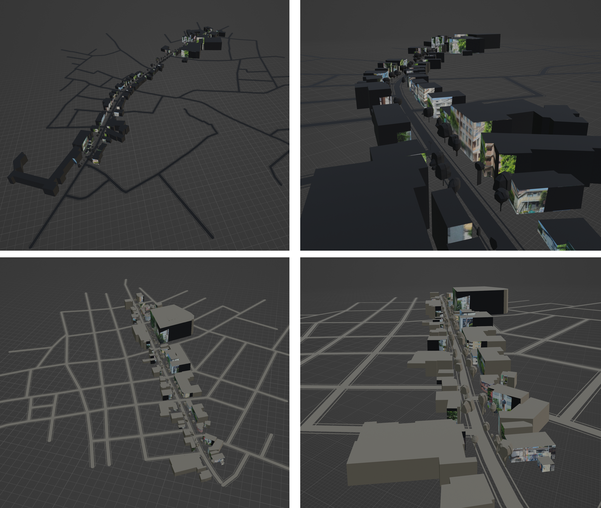

# gen3D_SVI

Generate .obj and CityGML (.gml) files for real city 3D scenes, used street view images (SVI) as reference information.

# Usage

Environment: Windows OS, CPU, Python
Lib:
```
numpy
pandas
trimesh
geopandas
earcut
lxml
shapely
pyproj
```

Run:
```
python gen3D_SVI.py
```

# Data and result samples

### SVI


### Point cloud and Semantic segmantation (intermediate data)


### Real 3D city model (final results)



