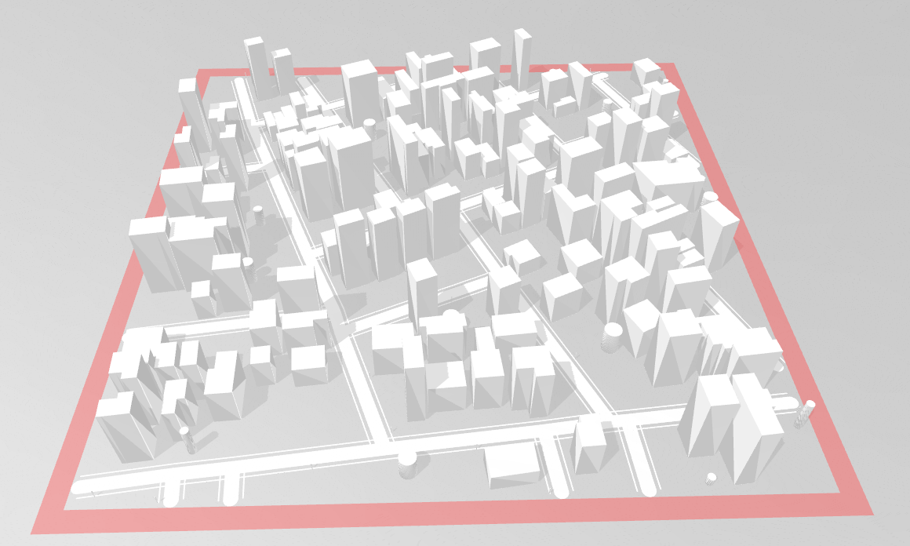

# gen3D_virtualCity

Generate .obj and CityGML(.gml) files for virtual city 3D scene

Results
---------------------
visualization of generated virtual city 3D scene (without relief)


Usage
---------------------
If generate building LOD>=2

```
python gen_mesh.py <random_seed ∈ [0, 65535] (int)> \
--lod_building <lod_building (0, 1, 2) (int)> \
--storey_low <storey_low ∈ [1, 50] (int)>
--storey_high <storey_high ∈ [1, 50] (int)>
--prob_t1 <prob_t1 ∈ [0., 1.]> \
--prob_t2 <prob_t2 ∈ [0., 1.]> \
--prob_t3 <prob_t3 ∈ [0., 1.]> \
--prob_t4 <prob_t4 ∈ [0., 1.]> \
--prob_t5 <prob_t5 ∈ [0., 1.]> \
--prob_t6 <prob_t6 ∈ [0., 1.]> \
--prob_t7 <prob_t6 ∈ [0., 1.]> \
--lod_road <lod_road (1)> \
--road_width_main <road_width_main (float)> \
--road_width_sub <road_width_sub (float)> \
--lod_vegetation <lod_vegetation (0, 1, 2) (int)> \
--low_tree_ratio <low_tree_ratio (float)> \
--high_tree_ratio <high_tree_ratio (float)> \
--lod_device <lod_device (0, 1, 2) (int)> \
--telegraph_pole_ratio <telegraph_pole_ratio (float)> \
--traffic_light_ratio <traffic_light_ratio (float)> \
--lod_relief <lod_relief (0, 1) (int)>
--output <output_folder (str)>
```

Command instance:

```
python gen_mesh.py 1024 --lod_building 2 --prob_t1 0.2 --prob_t2 0.3 --prob_t3 0.3 --prob_t4 0 --prob_t5 0.2 --prob_t6 0 --prob_t7 0 --lod_road 1 --road_width_main 1 --road_width_sub 0.1 --lod_vegetation 2 --low_tree_ratio 0.1 --high_tree_ratio 1 --lod_device 2 --telegraph_pole_ratio 1 --traffic_light_ratio 0.1 --lod_relief 1 --output ./result
```

Result (with relief):


CityGML(.gml) of building, LOD 2:


Change the random seed, generate different scene:

```
python gen_mesh.py 1888 --lod_building 2 --prob_t1 0.2 --prob_t2 0.3 --prob_t3 0.3 --prob_t4 0 --prob_t5 0.2 --prob_t6 0 --prob_t7 0 --lod_road 1 --road_width_main 1 --road_width_sub 0.1 --lod_vegetation 2 --low_tree_ratio 0.1 --high_tree_ratio 1 --lod_device 2 --telegraph_pole_ratio 1 --traffic_light_ratio 0.1 --output ./result
```

Result (without relief):


Example of Building/Vegetation/CityFurniture LOD=1:
```
python gen_mesh.py 1024 --lod_building 1 --storey_low 2 --storey_high 10 --lod_road 1 --road_width_main 1 --road_width_sub 0.1 --lod_vegetation 1 --low_tree_ratio 0.1 --high_tree_ratio 1 --lod_device 1 --telegraph_pole_ratio 1 --traffic_light_ratio 0.1 --output ./result
```
Result (without relief):


CityGML(.gml) of building, LOD 1:


Dataset
---------------------
For this code, we should have the basic 3D component, such as .obj files of buildings/vegetation/trafficLights/..., the
dataset should be organized as below:
```
gen3D_virtualCity
└── data
    ├── src_2d
    │      ├──dem
    │      └──shp
    └── src_3d
           ├──lod3frn
           ├──lod3veg
           ├──obj
           ├──merged_filter1.csv
           └──tree_label.csv
```

TODO
---------------------
- Fix the issue that the CityGML(.gml) output doesn't exactly up to standard.