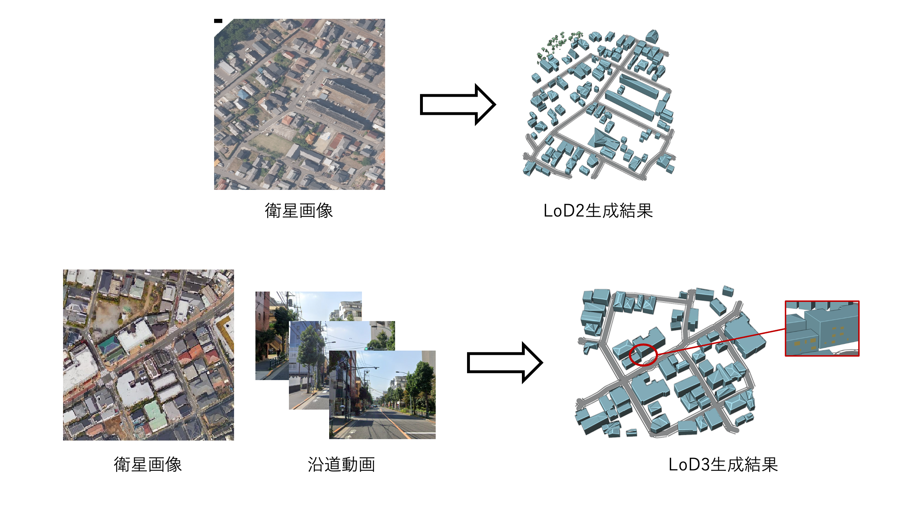

# 3D都市モデル生成シミュレータ

本リポジトリでは、Project PLATEAUの令和5年度のユースケース開発業務の一環として行われた「dt24-05 3D都市モデル生成シミュレータ」の成果物である「3D都市モデル生成ツール」のソースコードを公開しています。

「3D都市モデル生成ツール」は、建物フットプリントデータやユーザーが指定するパラメータに基づき、3D都市モデル（建築物、道路、植生、都市設備）を自動で生成するWebオーサリングツールです。このツールは、衛星画像や沿道画像の範囲の3D都市モデルの作成に対応しており、詳細レベル（LOD）の向上機能（LOD1-3）を備えています。

