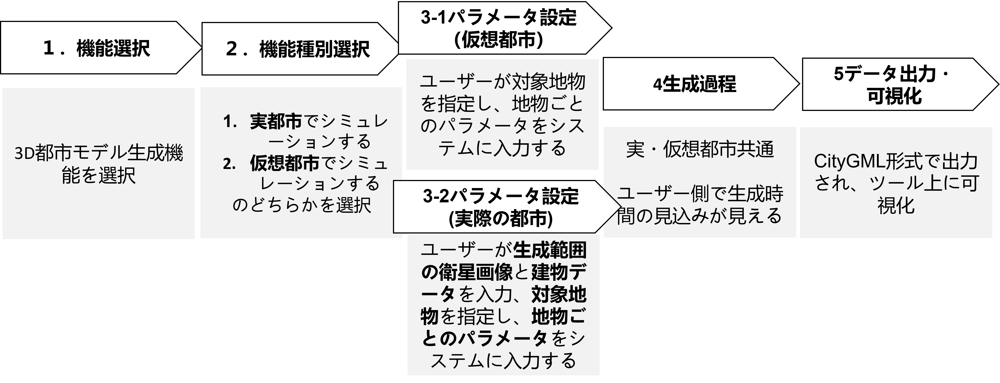
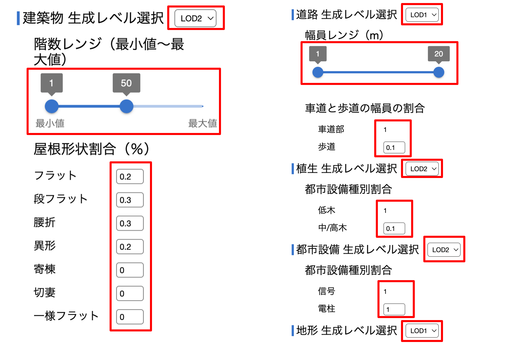
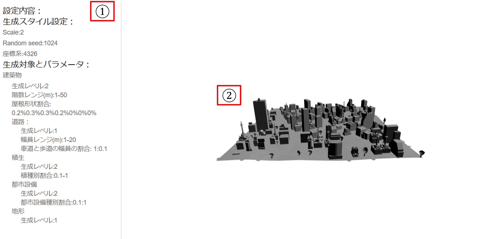
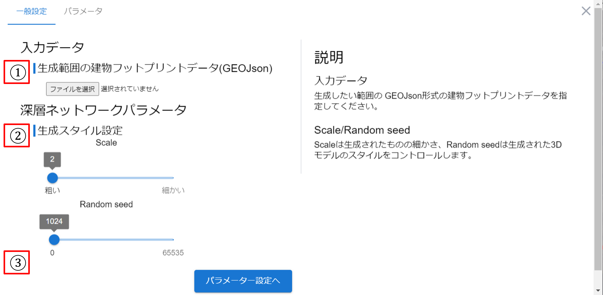
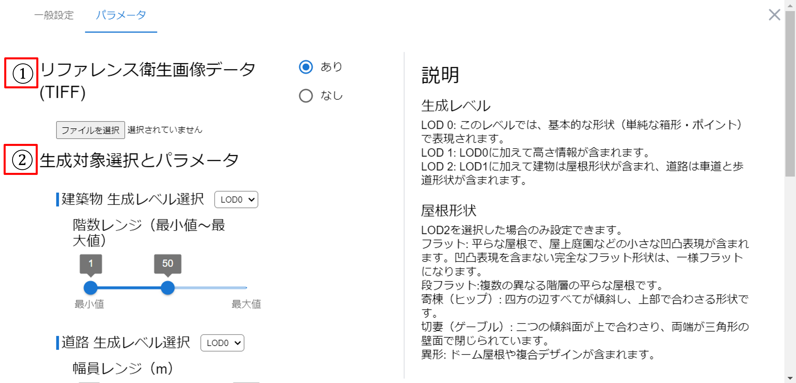
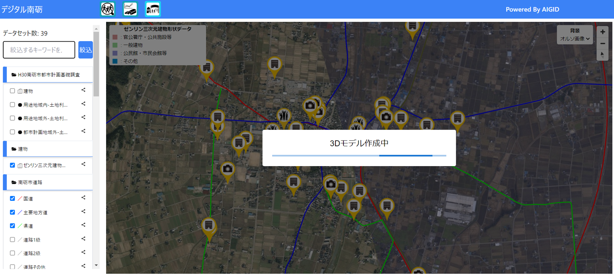

# 操作マニュアル

## 1 本書について

本書では、3D都市モデル生成シミュレータシステム（以下「本システム」という。）の操作手順について記載しています。

### 3D都市モデル生成までの流れ

## 2 機能選択

① デジタルシティサービスにアクセスし、“3D都市モデル生成シュミレーター”をクリックし、生成を行う画面へ移動
https://aigidjp.github.io/digitalcity_3D_city_model_simulator/

## 3 機能種別選択

## 3-1 仮想都市の場合

### 3-1-1 一般パラメータ設定（仮想都市:200*200mグリッド）

生成スタイル（Randomseed）を設定します。

### 3-1-2 詳細パラメータ設定（仮想都市）

各地物のパラメータ設定：対象地物（建築物、道路、植生、都市設備、地形）別に、LOD（詳細レベル）、地物固有のパラメータを設定します。

### 3-1-3「実行」をクリックすると生成が開始されます。

## 3-2 モデル生成:（仮想都市）※約5分かかります

## 3-3 データ出力・可視化（仮想都市）

①設定内容を確認できます。
②可視化: ツール内で直接生成された3D都市モデルを閲覧（ズーム，回転）できます。

## 4-1 実際都市の場合

### 4-1-1 一般パラメータ設定（実際の都市）

①データ入力：生成したい建物のフットプリントデータ（GeoJSON形式）を選択します。

②生成スタイル：ScaleとRandom seedを設定します。

③出力フォルダ指定：出力される3D都市モデルのファイルの保存先を指定します。

### 4-1-2 詳細パラメータ設定（実際の都市）

①リファレンスデータ入力：対象地域の衛星画像（TIFF形式）を選択します。

②各地物のパラメータ設定：対象地物（建築物、道路、植生、都市設備、地形）別に、LOD（詳細レベル）、地物固有のパラメータを設定します。

③”実行”をクリックすると生成が開始されます。

## 4-2 モデル生成：（実際の都市）※約40分かかります

モデル生成プロセスを開始します。入力データとパラメータに基づいて自動的に3D都市モデルを生成します。

## 4-3 データ出力・可視化（実際の都市）

①設定内容を確認できます。
②可視化：ツール内で直接生成された3D都市モデルを閲覧（ズーム，回転）できます。

