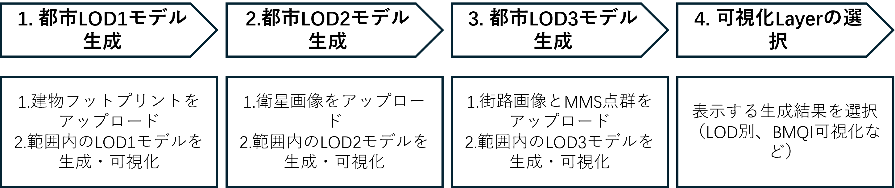
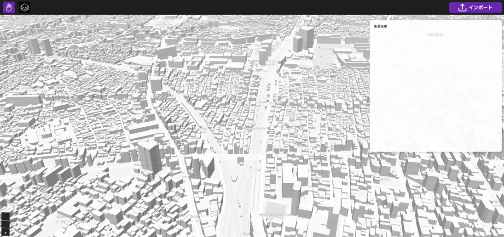
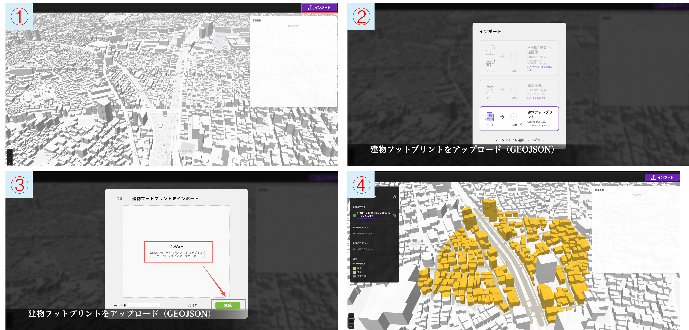
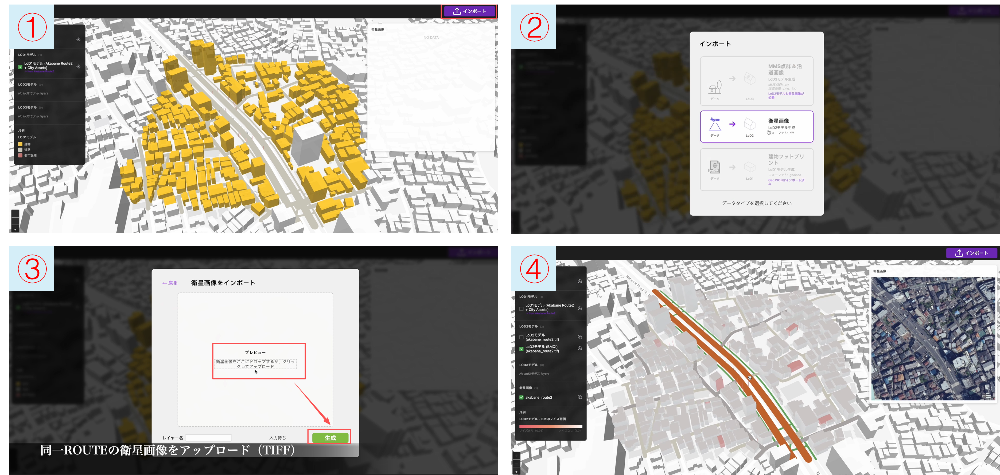
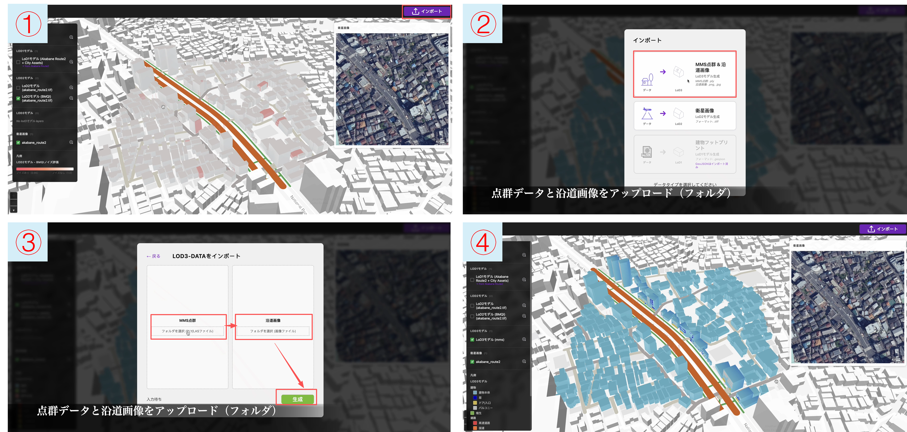
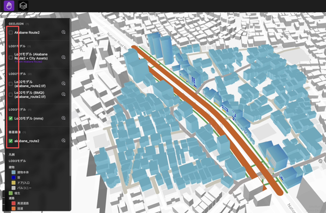

# 操作マニュアル

## 本書について

本書では、3D都市モデル生成シミュレータシステム（以下「本システム」という。）の操作手順について記載しています。

### 3D都市モデル生成までの流れ

## 1 都市LOD1モデル生成

デジタルシティサービスにアクセスし、生成を行う画面へ移動
http://localhost:8080

①建物フットプリントをアップロード
②範囲内のLOD1モデルを生成・可視化

## 2 都市LOD2モデル生成

①衛星画像をアップロード
②範囲内のLOD2モデルを生成・可視化

## 3 都市LOD3モデル生成

①街路画像とMMS点群をアップロード
②範囲内のLOD3モデルを生成・可視化

## 4 可視化Layerの選択

表示する生成結果を選択（LOD別、BMQI可視化など）

