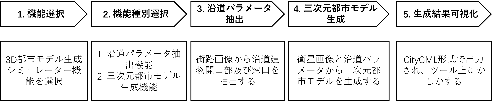

# 操作マニュアル

## 本書について

本書では、3D都市モデル生成シミュレータシステム（以下「本システム」という。）の操作手順について記載しています。

### 3D都市モデル生成までの流れ

## 1 機能選択

① デジタルシティサービスにアクセスし、“3D都市モデル生成シュミレーター”をクリックし、生成を行う画面へ移動
http://gen3d.sekilab.global/

## 2 機能種別選択

## 3 沿道パラメータ抽出

抽出ルートを設定します。実行には約40分かかります。

## 4 三次元都市モデル生成

衛星画像を入力し(.tif)、生成するLoDを設定ます。実行には約10-15分かかります。

## 5 生成結果可視化

①入力衛星画像。
②生成結果可視化：ツール内で直接生成された3D都市モデルを閲覧（ズーム，回転）できます。

